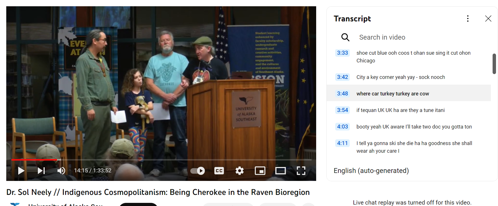
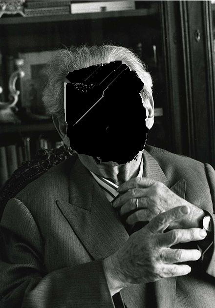

>>Chalagi gadi soli dagudoa  
Sol Neely daguadoa  
ayoneega  gadi  
nagu jigi  
Allensberg Washington  
chineyla asehno  
Alaska  
Tinglit Aani  
chalagi  
de lacagowe   
al de school chalagi   
degladagoowee  
adigay  
coleegayay  
digay  
wolodichnon  

Phenomenal, non?
I don't know what it means. 
I recognize only the names given to relations with others: Sol Neely,  Allensberg, Washington, and the concrete locality of Lingít Aaní, Tlingít ancestral land (the word “lingít” means “human”), where Sol Taught at University of Alaska Southeast (UAS), the "Raven Creator Bioregion", a term coined by the father of Tlingit/Inupiaq writer Ishmael Angaluuk Hope.  Hope explains that through the wild trickster Raven are told epic stories of the transfomration of the land of the Tinglit.

Trickster stories are the translation of liberation, and the shimmer of imagination is the liberation of the last trickster stories. ( Manifest Manners,
and (3) recover the polyhistorical mind of a “trickster hermeneutics”—as a translation of creation and liberation—that enables a rich encounter with story and the deep, abiding kinship it supports. 

The sound of Sol's speech begins with the regard of an other person, the smiling face of his friend to say "me voici"

We tricksters have to honor each other so I give this talk in honor of Sol Neely 

We must hear the speaking of Sol Neely again, allow us to inspire us, listen to his recurrent cry to hear Levinas translated 
n a 2016 paper, Sol Neely, our great friend, asked us to allow the writings of Emmanuel Levinas to become inspired by indigenous thought so that we could learn to take ethical responsibility through "the social relation—the irreducible kinship relation expressed by 'all my relations' — the utterance itself of ancestry and place by which the noise and sounds of nature are at last heard through an inspired eco-phenomenology."1. The question of our ethical relationship to nature seems especially pertinent now, both for us right here right now at this conference where we are considering the relationship between humanism and otherness, and for us as humans responsible for the exploitation and decimation of the natural world.

SOL NOTES
==========

* Such language is the in-verse of a Levinasian phenomenology for which inspiration precedes intentionality in a way that does, in fact, interrupt the intentional stance.
* The purpose of this critical exposition of David Wood’s starting point is not necessarily to engage in polemics but to identify a tendency within phenomenology that does not sufficiently account for the persistence of intentionality that Levinas exposes as an aiming of thought—of the recuperation of the other into the sameness of intentional consciousness.
* QUANTUM: tie this in with the refrigerator
* before the tranquility of the “sounds and noises of nature.” But the transcendence of words also means this: “[I]n social relations the real presence of the other is important; but above all it means that this presence, far from sig-nifying pure and simple coexistence with me, or expressing itself through the romantic metaphor of ‘living presence,’ is fulfilled in the act of hearing” (148). This is radical, and
* from the point of view of the utterance, when they remain mired in the tranquility and materiality of things at rest, registered only in the medium of sound with all its aesthetic self-sufficiency. In contrast, it is the social relation—the irreducible kinship relation expressed by “all my relations”— the utterance itself of ancestry and place by which the noise and sounds of nature are at last heard through an inspired eco-phenomenology. This does not mean that Levinas characteristically hierarchizes “ethical (i.e., human) language over the language of things” as Toadvine claims, nor does it mean that the sounds of nature are mere “themes” of human speech. Rather, it means that “becoming human”
* requires this inspiration, this revelation of responsiveness to the transcendence of words that is neither entirely reducible to flesh—and thus, as Levinas writes, “assures a presence among us” (148)—nor to the aesthetic self-sufficiency of the inertia and materiality of things at rest.
* become human, to become Tlingít, means to take up our responsibility inspired by the voices of ancestry made legible through the language and the sounds of nature. To become human means becoming responsible in a rich kinship of human and other-than-human relations. This content downloaded from

SNAKE FACE
eco-phenomenology. For example, there is an interview with Levinas to which many eco-phenomenologists appeal in which
Levinas is asked, “Does a snake have a face?” And Levinas responds, “I don’t know if a snake has a face. I can’t answer that question.” Responses to Levinas’s lack of a response vary:

THE POWER OF THE NEGATiVE. THE UNKNOWING, THE OTHERNESS
The Other in Parmenides is non-being.  Quote from Levinas here

“I don’t know if a snake has a face”—then—is not to hierarchize the human over the other-than-human in the reductive speciesism Levinas’s critics want to attribute to him; rather, it’s to say, I don’t know if a snake (or even stones or streams) experiences revelation and inspiration in this way that constitutes my humanity. To become human, however, is to take up this responsiveness.

# Faceless Levinas

We will begin with the anarchy of a faceless Levinas, considering what Levinas means by the "face of the earth" in Totaltiy and Infinity the depht and gravity of materiality, of motherhood in Otherwise than Being. 

I dare Levinas scholars to become iconoclasts, like Abraham, to smash the idol of the face

* “Does X have a face” is always the wrong question
Straightforwardly ontological, predicative
Reification of the face as a thing
Face is idolatry. You never look at the face of God

The problem begins in the book of Exodus, when the prophet Moses, speaking with God on Mount Sinai, asks God to show Moses his glory. God warns that: "…You cannot see my face, for no one may see me and live." (Exodus 33:20, NIV) 
The face isn't a thing. The mistake of reification, predication, ontological attribution is all over the scholarship. "The Face" is a mode of relating, one that is fundamentally ambiguous as you point out. This is an obvious truth: I see everything Gad presents as himself, as his Face, on his Facebook for example as a mode of self-presentation, but is that presentation of Face really who Gad is? Yes and no. The Face is a fundamentally ambiguous presentation. Moreover, "le visage" is a sort of a metonym for "intentionality" in general and sort of a wordplay on vision, vis-a-vis, videre (to see). It's an inquiry into the positionality of the one who sees, the one who looks, an inquiry into the position of the masculine, virile Subject. The face-to-face is a reconsideration of Hegel's struggle between self-consciousnesses, but this absolutely not the only nor the most important dynamic in Levinas. It's his undermining of all that macho bullshit of virile subjectivity. In his later works, he makes it more clear that the face is not the most important concept.
Really: worship of the Face in Levinas is flat out idolatry
I haven't read this article and I probably won't any time soon. In general, the idea of the "Face" is widely misunderstood. You get scholars asking dumb questions like "What is the face" and "Does X have a face". This is very clearly an ontological question, one of predicaton, of the Being of Face. Clearly the wrong question, reifying question.

In Sol's paper, he refers to a discussion 
“Le Visage” = Intentionality
Vision
Visuality
Intentionality The Subject Position
Man-to-Man position
Persectivism in Levinas the visage is not the only important viewpoint
“Le visage” is a straightforward wordplay, well-known philosophical trops
Vis a vis, vision
Intentionality of the seer, the power of theoria, of consciousness to subsume the external as internal
A seer is a subject, a masculine and virile subjectivity
The face-to-face is a man-to-man faceoff, a reconsideration of Hegel’s struggle for self-consciousness

Iconoclasm Anarchic, Faceless Levinas
In his later work, Levinas stops using the language of the face
Prevents the ontological error of thinking the face is a thing
His work foregrounds the depths from which subjectivity is given birth by maternity
Faceless becoming

allomothering, other than mother
in indigenous it's the house
in jewish, the schul, the learning center,
teaching as allomothering

['./']()
LEmon Creek Correctional Facility 

on al lingis: i visited him in baltimore in 2006 while hounding and hitchhiking to the NALS conference at Purdue i love that crazy fool and his pet peacocks  

autoethnography  is always a heteroethnograpy
sol of the past -> self as other
sol's family
others, both friendly and unfriendly