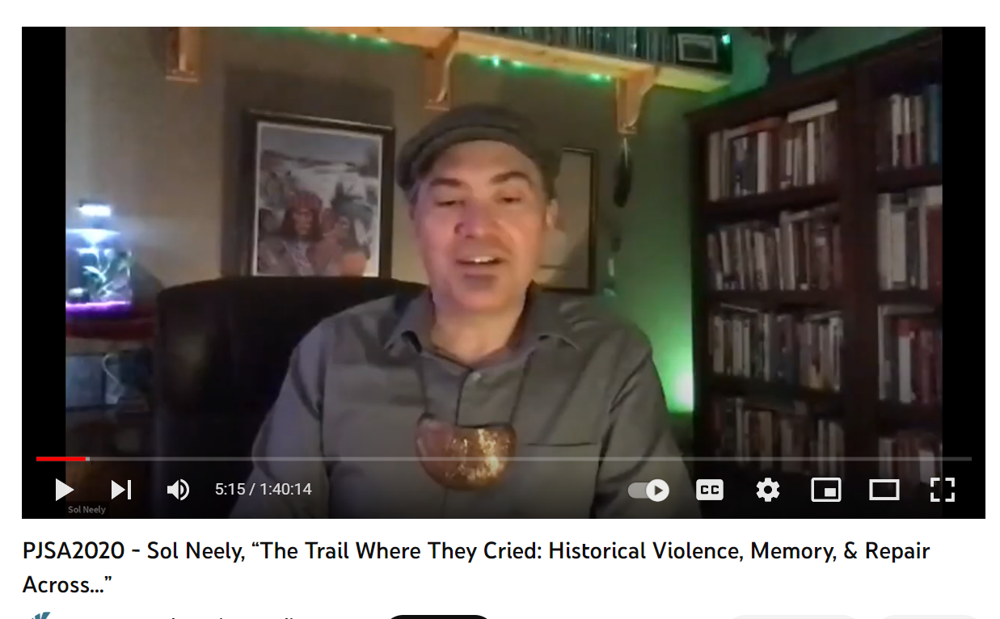
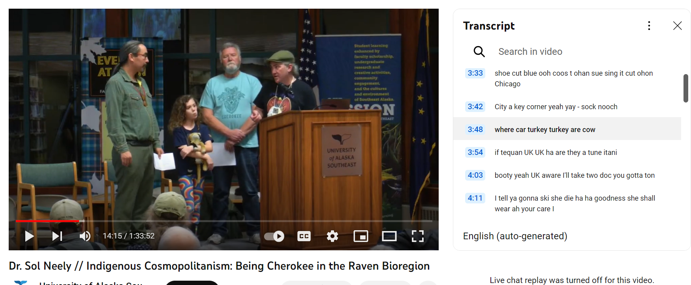
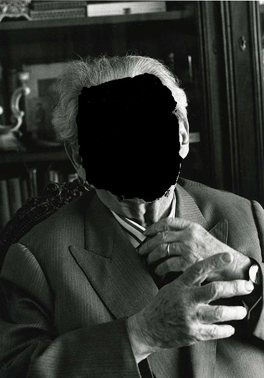
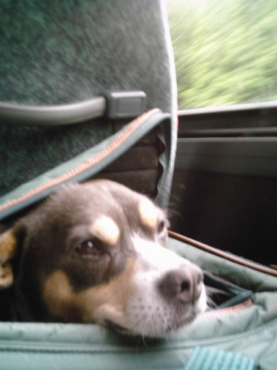
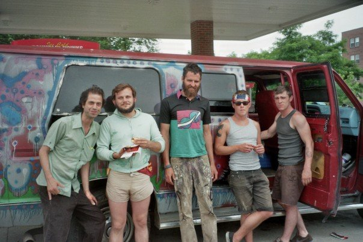
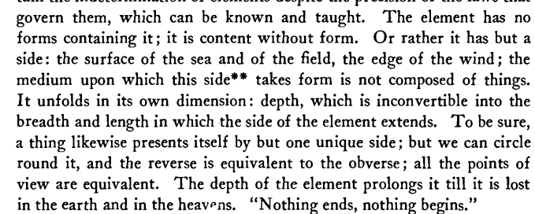
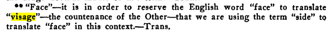
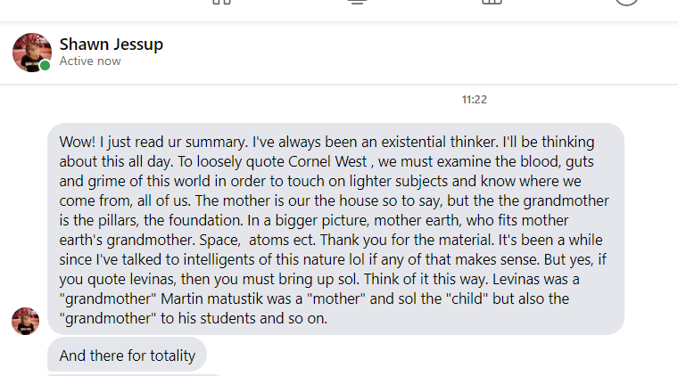

>>Chalagi gadi soli dagudoa  
Sol Neely daguadoa  
ayoneega  gadi  
nagu jigi  
Allensberg Washington  
chineyla asehno  
Alaska  
Tinglit Aani  
chalagi  
de lacagowe   
al de school chalagi   
degladagoowee  
adigay  
coleegayay  
digay  
wolodichnon  

Phenomenal, non?  
I don't know what it means.
 
I recognize only the names given to relations with others: Sol Neely,  Allensberg, Washington, and the concrete locality of Lingít Aaní, Tlingít ancestral land (the word “lingít” means “human”), where Sol Taught at University of Alaska Southeast (UAS), the "Raven Creator Bioregion", a term coined by the father of Tlingit/Inupiaq writer Ishmael Angaluuk Hope, named for the Raven trcikster whose stories narrate the transformations of the land

The sound of Sol's voice in the video begins with the image of the smiling face of his friend Wim Laven listening to him, regarding him, awaiting his revelation, his "me voici".  We still have much to learn from hearing the teaching of Sol Neely.

In a 2016 paper, Sol Neely, our great friend, a father, a husband, a son, a teacher, an activist, and a great Levinas scholar, asked us to allow the writings of Emmanuel Levinas to  become inspired by indigenous thought so that we could learn to take ethical responsibility by becoming attuned to "the utterance itself of ancestry and place by which the noise and sounds of nature are at last heard through an inspired eco-phenomenology."  

He learned to become human in Linglit `Aani where he situated himself as a professor at University of Alaska South East and The Flying University at The Lemon Creek Correctional Facility, learning from those around him that becoming human entailed becoming responsible in a rich kinship of human and other-than-human relations. 

The question of how we relate to nature and how we will liberate the incarcerated seems especially pertinent right now, both for us right here right now at this conference where we are considering the relationship between humanism and otherness, and for us as humans responsible for the exploitation and decimation of the natural world [ Add something about prison abolition ].

In his paper, Sol explains that several eco-phenonenologist have accused Levinas of setting up human beings at the top of a heirarchy among species based on an interview with Levinas, in which he is asked, “Does a snake have a face?” And he responds, “I don’t know if a snake has a face. I can’t answer that question.”

Sol responds to these objections by responding that Levinas is not creating a heirarchy here but instead is his acknowledgment that animals and nature in general experiences revelation and inspiration in a different way than we do.

I would add my own notes to this.  
First of all, the uproar over a being "not having a face" indicates a wider misunderstanding of how negativity functions in the work of Levinas.  From the very beginning of his writing, he indicates that negation is one of the modes of alterity.  As he states even already in his doctoral thesis:  the existence  of material things contains in itself a nothingness, à possibility of not-being and reiterated in Otherwise than Being .
The genealogy of self and othe ris not just a relation between two people but also the modality of the becoming of the individual rhgouth a continuous creation where self becomes other to self.

Parracide of Parmenides who states that you cannot speak about (? is it just a metter of speaking -- check plato ) non-being.
Parricide is actualy  areference to a moment of this genealogy where the other of the father is murdered or commits suicide or sacrifices hiimself for the son. Otherwise than Being focuses on the mother trather than the son.  (add a reference to the section in TI)
parricide is also an oblique reference to the narrative of continuous creation, 
quote here from Levinas OTB
levinas is talking about a fundamental question of philsophy: in what way does identity or difference persist over time.  
Firs of all, 

negative moment of the il y a what's happening in that moment of negation which Levinas refers to as the il y a, * but ths negativity is the crux of otherness, exploration of this negativity is what Levinas explores over and over

# Faceless Levinas

But even more essentially that the negative, the question of the intereviewers betrays a fundamental misconception of the face.
* “Does X have a face” is always the wrong question
* Straightforwardly ontological, predicative
* Reification of the face as a thing
"Does X have a face". This is very clearly an ontological question, one of predicaton, of the Being of Face. Clearly the wrong question, reifying question.

* Face is idolatry. You never look at the face of God "You cannot see my face, for no one may see me and live." Exodus 33:xx (find citation)
I dare Levinas scholars to become iconoclasts, like Abraham, to smash the idol of the face
 The Face is a fundamentally ambiguous presentation. Moreover, "le visage" is a sort of a metonym for "intentionality" in general and sort of a wordplay on vision, vis-a-vis, videre (to see). 
"In each of these acts, our gaze is directed like a ray from the pure ego to the object correlated to the relevant state of consciousness (thing, state of things, etc. ) and achieves the consciousness of this object which may be very different from case to case.” (Theory of Intuition in Husserl's Phenomenology)
* Intentionality of the seer, the power of theoria, of consciousness to subsume the external as internal
* A seer is a subject, a masculine and virile subjectivity
* The face-to-face is a man-to-man faceoff, a reconsideration of Hegel’s struggle for self-consciousness

 It's an inquiry into the positionality of the one who sees, the one who looks, an inquiry into the position of the masculine, virile Subject. The face-to-face is a reconsideration of Hegel's struggle between self-consciousnesses, this man-to-man face off, but this absolutely not the only nor the most important dynamic in Levinas.  * Persectivism in Levinas the visage is not the only important viewpoint
  It's his undermining of all that macho bullshit of virile subjectivity. In his later works, he makes it more clear that the visage is not the most important concept.
* In his later work, Levinas stops using the language of the face
* Prevents the ontological error of thinking the face is a thing
* His work foregrounds the depths from which subjectivity is given birth by maternity
* Faceless becoming

### The Face is Not The Visage

But Levinas does use the word "la face" in Totality and Infinity but in a way that is way that is profoundly mistranslated in the English renditiosn.  

I visited World traveler, philosopher, translator, and fellow trickster Alphonso Lingis at the Baltimore Travel Plaza with my bestest pal Shorty The Dog -- to he i am for evva true -- in Baltimore in 2006 while hounding and hitchhiking to the NALS conference at Purdue i love that crazy fool and his pet peacocks. 

Caption: Shorty The Dog, snuck onto a Greyhound Bus

Caption: The van from Bloomington was running on vegetable oil or something and kept on stalling on the highway. Just as we pulled into West Lafayette, it ran out of diesel too.

In TI (find the section), Levinas states"
> Il se déploie dans sa propre dimension la profondeur, inconvertible en largeur et en longueur où s'étend *la face de l'élément*. La chose, certes, elle non plus, ne s'offre que par une face unique; mais nous pouvons en faire le tour, et l'envers en vaut l'endroit. Tous les points de vue se valent. La profondeur de l'élément le prolonge et le perd dans la terre et dans le ciel « Rien ne finit, rien ne commence. » (my italics, gote)

> It unfolds in its own dimension: depth, which is inconvertible into the breadth and length in which the side of the element extends. To be sure, a thing likewise presents itself by but one unique side; but we can circle round it, and the reverse is equivalent to the obverse; all the points of view are equivalent. The depth of the element prolongs it till it is lost in the earth and in the heavens. “Nothing ends, nothing begins.

Lingis explains his choice:

> Translator’s Note: 
> It is in order to reserve the English word ‘face’ to translate ‘visage’ — the countenance of the Other — that we are using the term ‘side’ to translate ‘face’ in this context.

Several things to note here
* The dimension here is *depth* as opposed to *height*
* Materiality, The Self attached to the Ego in Time and the Other
* Materiality of Maternity in Otherwise than Being
* Gravity, Curvature of Space Time, etc
(for further discussion see Metaphorics esssay) 

### THe question of the element is a hugely important question for Levinas, from the outset of his philosphjical inquriy
Problem of war and polemos
* Takes a special importance in the "Reflections on the Philosophy of Hitlerism" which he begins "The philosophy is simplistic.   But the primitive powers that burn within it burst open its wretched phraseology under the pressure of an 
elementary force. . For these elementary 
feelings harbor a philosophy. (LOOK THROUGH ESSAY FOR "ELEMENT")
 the Self is also constituted by these elements -- the blood, the appeals of heredity and the past for which the body serves as an enigmatic vehicle,
•WAR AND CONQUEST  it is that very expansion that constitutes 
the unity of a world of masters and slaves ... an ideal that simultaneously brings with it its 
own form of universalization: war and conquest

### Continuous Creation: 
So this problematic of the element runs throughout Levinas and Levinas seems to really think through it in Otherwise than Being when discussing themese of sensibility, of materiality and maternity

It's important to understand a proper understanding of the element in order to counter the notion of Heraclitus's idea of brecoming

 an idea that is central to Nietzche's creation, Heidgerr's ecstases, Deleuze's becoming, Foucault's geneaology and so on.  

Heraclitus Fragment that asserting that no one can step into the same river once is 

To do this, we begin by considering Levinas's work as an inversion of not only Heidegger's thinking of Being but moreover as a perversion of Heraclitus's thinking of Becoming, whose dictum  Πάντα ῥεῖ[^1],  everything flows, is complemented by his assertion that war is the master-father of all beings[^2] .  Levinas opens up Totality and Infinity renouncing the
> obscure fragments of Heraclitus { that } prove that being reveals itself as war to philosophical thought.[^3]   
 

"the discontinuity of Cartesian time, which requires a continuous creation,"

But he starts working there already with the idea of continuous cretion, which appears in his post-war essays.  

Levinas attributes this idea of continuous creation to Descartes and Bergson 
> Descartes: it does not follow that we shall exist a moment from now,  unless there is some cause—the same cause which originally produced us — which continually reproduces us, as it were, that is to say, which keeps us in existence
> Bergson: Creation would have appeared not simply as continued, but also as  continuous. The universe, regarded as a whole, would really evolve. The future would no longer be determinable by the present
The indeterminacty of futurity is one oof the aspects of alterity (Find TI quote)

The idea of continuous creation is used as a foil to the theory of becoming

### Continuous Creation 
30 You will send forth Your spirit and they will be created, 
and You will renew the face of the earth.
ל תְּ שַׁ לַׁ ַּ֣ ח ר֖ וּֽ חֲָך יִ ב ּֽ רֵ א֑ ון וּ֜ תְּ חַׁ דֵֵּ֗ ש פְּ נֵ ַּ֣י אֲד מ ּֽ ה
Psalm 104:29-30
Bergson: 

### Regeneration precedes πόλεμος 
• Levinas’s doctrine of non-Heraclitean Becoming
On n'a pas besoin de prouver par d'obscurs fragments d'Héraclite que l'être se révèle comme guerre, 
• Levinas famously starts Totality and Infinity declaring that “We do not need obscure fragments of Heraclitus to prove that being reveals itself as war.”
• Heraclitus whose dictum Πάντα ῥεῖ1, everything flows, is 
complemented by his assertion that war is the master-father of all 
beings2
War (πόλεμος) is the father-master (πατήρ) of all beings; and some he has made gods and some men, some slaves and some free.
This conception of the master-father as the source of Becoming is paradigmatic of the male barracks warrior-hero, as Nancy Hartsock 
explains, finds its correspondence in the patriarchal political model found in Aristotle's politics, but an alternative for that koinon or 
commoning is the matrisocial sphere of take care of the needs sphere of the oikos. the needs that from birth as we are birthed as a 
needy being into the world, breathed into the wold
This idea of becoming as force inspires the entire genealogy descended from Heraclitus, opposition of forces runs through Locke's 
billiard ball empiricism4 and Hobbes's mechanistic5 and Hume6, Newton's forces, Spinoza's conatus, Hegel's dialectic, Nietzsche's 
will to power, Heidegger's ecstatic Being, Deleuze, Foucault, as so on.7
• Deleuze and Spinoza are widely influential in contemporary ecological thought in for example in for example post-humanist 
philosopher Ross Bradiotti’s conception of a “Politics of Life as Bios/Zoe”. Heidegger in deep ecology, anarchoprimitivism, and ecophenomenology

### Regeneration of generations
For Levinas, the generative family demonstrates that, rather than merely issuing from an 
origin, existence is a continuous creation
• Time as continuous creation, as the genesis of gendered generations, time as 
continuous regeneration
There is a sense in which Totality and Infinity may be read as if were the first Book of 
Moses, Genesis or ית ִׁאש ֵר ְּב, } There is a footnote here } the story of the regenerating 
engendering of generations. It tells a story of life stage development, from the newborn 
nursing on the element through job and mature home ownership, through old age, through 
sex and sacrifice and murder, to the rebirth of a new subjectivity who begins the story at 
the start in naissance an . At the end you realize that the sacrifice and murder of the self is 
what constituted the infant at the beginning

### Continuous Rebirthing at Every moment
• This is emphasized not just as the family scheme but showing how it is at every moment this 
reorientation
• The expression "in one's skin" is not a metaphor for the in-itself; it refers to a recurrence in 
the dead time or the meanwhile which separates inspiration and expiration, the diastole 
and systole of the heart beating dully against the walls of one's skin. The body is not only an 
image or figure here; it is the distinctive in-oneself of the contraction of ipseity and its 
breakup.12 This contraction is not an impossibility to forget oneself, to detach oneself from 
oneself, in the concern for oneself. It is a recurrence to oneself out of an irrecusable 
exigency of the other, a duty overflowing my being, a duty becoming a debt and an extreme 
passivity prior to the tranquillity, still quite relative, in the inertia and materiality of things at 
rest. It is a restlessness and patience that support prior to action and passion. Here what is 
due goes beyond having, but makes giving possible. This recurrence is incarnation. In it the 
body which makes giving possible makes one other without alienating. For this other is the 
heart, and the goodness, of the same, the inspiration or the very psyche in the soul.
The temporalization of time-the openness by which sensation manifests itself, is felt, modifies itself without altering its identity, doubling itself up by a sort of diastasis of the 
punctual, putting itself out of phase with itself-is neither an attribute nor a predicate expressing a causality "sensed" as a sensation.
The ego is in itself like a sound that would resound in its own echo, the node of a wave which is not once again consciousness.
the trope of the body animated by the soul, psyche in the form of a hand that gives even the bread taken from its own mouth. Here the psyche is the maternal body.
deBroglie matter waves

### Maternal Body
◦ Indeed in the transcendence of intentionality diachrony is reflected, that is, the psyche itself, 
in which the inspiration of the same by the other is articulated as a responsibility for 
another, in proximity. Sensibility is in this way situated back in the human exception. But 
one has to go back from this reflection to the diachrony itself, which is the-one-for-the-other 
in proximity. It is then not a particular signification. The-one-for-another has the form of 
sensibility or vulnerability, pure passivity or susceptibility, passive to the point of becoming 
an inspiration, that is, alterity in the same, the trope of the body animated by the soul, 
psyche in the form of a hand that gives even the bread taken from its own mouth. Here the 
psyche is the maternal body.
◦ Again the question of body, of gravity, of weight that he was working on, the curvature of 
space-time in Totality nd Infinity 
1. Or do the being encumbered with oneself and the suffering of constriction in one's skin, better 
than metaphors, follow the exact trope of an alteration of essence, which inverts, or would invert, 
into a recurrence in which the expulsion of self outside of itself is its substitution for the other?

Anarchic Materiality, the Matrisocial
• Also bring in Kropotkin
* Charondas in Aristotle
* Barbara Mann eating out of the same bowl

### The Flying University: Allomothering as Maieutics

maieutic (adj.)
"pertaining to the Socratic method of assisting a person, by questions, to discover conceptions latent in his mind," 1650s, from Greek maieutikos, a figurative use in philosophy of a word meaning literally "obstetric," from maieuesthai "act as a midwife," from maia "midwife" (see Maia).

By putting leading questions on general or well-known facts, Socrates, by easy steps, to the surprise and delight of his subject, would bring him to the enunciation of some principle hitherto unknown or undeveloped in his mind. This is called his Maieutic: a term which Socrates himself suggested, likening his relation to the development and birth of ideas in the mind to that mid-wife office which his mother performed for the body. Both this feature and the illustration afforded fine material for jest to Aristophanes, who, in his usual comic way, proceeded to literalize the metaphor. [Samuel Ross Winans, "Xenophon's Memorabilia of Socrates," Boston: 1890]

allomothering, other than mother
in indigenous it's the house
in jewish, the schul, the learning center,
teaching as allomothering

LEmon Creek Correctional Facility 

    um but this story uh she tells me takes place at clingman's dome uh kuwahi which
    is the cherokee word for this area today it's called clingman's dome it's the highest point on the appalachian trail
    um and so i actually i tried to find the video i my dad and my daughter and i we
    broke off the the main path there and i read this story out loud but i can't find that video so i'm going to read it uh real
    quick to you all it's called people singing in the earth long before the tragedies of the people
    happened the cherokees were sitting in a council house you can imagine this big building sitting on top of a mound with
    thousands of seats inside and they're all gathered in the middle of winter and there's a big fire
    crackling in the middle of the council and the chiefs are all gathered in the center at the bottom and the people are
    listening listening to the oral history being told or to the business being discussed
    when all of a sudden with no wind whatsoever outside the bare skin on the
    council house opens up wide enough for a person to come through and then it sort of folds back
    and then all of a sudden drops back into place the cherokee being very spiritual as
    they were in those days realized that someone some spirit had entered the council house
    so they sat very quietly and sure enough up in the corner of the council house they began to see a light
    a sort of greenish-colored light materialized and it soon turned into a person
    they knew this person was a cherokee but they didn't know who he was he came down to where the chiefs were
    sitting and he said you my brothers and sisters must follow me for out of the east will come a group of
    people who will destroy your homes and your villages will be burned and your children will be killed and your
    homeland will be taken away and never again will you be happy and so the cherokee said no we can't
    leave because this land belonged to our mothers mothers mothers
    he said i'll be back in seven days and you must fast and decide whether you'll go with
    me or stay here and suffer in seven days he came back again
    and half of the people had decided to follow him half had decided to stay home
    and so when he came the half that followed him went up toward the mountain the sacred mountain of the cherokee
    which is today called clingman's dome and he got to this great massive
    rock cliff and he touched it with his hand and the whole cliff opened up and you could hear people singing and
    laughing inside the mountain and the stairwell leading up to a beautiful land of springtime and summer
    and the people began to march in with the butterflies flying and the fruit trees bearing fruit and the people were
    all happy one man at the end decided that he had left his family there in the
    village and he wanted to go back and get them and bring them to this beautiful land
    so he rushed back to the village and headed back to the mountain when he got back to the mountain with his family the mountain had closed up
    and they said he was crazy and they left him there alone he stayed there for seven days and on
    the seventh day he began to hear the singing deep within the earth and so he went back to the village
    and from that day forward he told the people in the village that if you're quiet enough long enough and if you sit and listen to
    the streams and really are aware and very quiet and still
    that you too can hear the people singing within the earth those happy ones that went on before
    and sure enough the settlers came and they began to burn the villages and take away the land and the cherokee people
    have been searching for that happiness they had long long ago and i think the teaching of this
    story not only was the fact there was a revelation of what was about to happen
    people losing their homeland on the trail of tears and so on but also to teach us that we should
    never let the child disappear from us you remember when you were a child when
    you would take off your shoes and prawn through the mud puddles and laugh and sing remember when you were a child that not
    a butterfly passed that you didn't see it and chase it and not an animal or an insect were
    overlooked and that you were so close to nature and so close to mother earth that those were the things that were
    important to you we should remain like children and sometimes take our shoes off and prod
    through the mud puddles and sit by the streams and listen to the talking of the streams and the whispers of the wind
    we must preserve the earth and we must value the lives of our elders in the lives of our children and save them a
    place to live if we don't then there will be a revelation for the people of today as
    well as for all of the cherokee i love that story for a couple of reasons one because my daughter was on
    the trail of tears with us and she loved the butterflies i actually have a video of her at clingman's dome here and i
    asked her what is different about this place than king garani in alaska where we were living she says there's more butterflies here and when we were at the
    sacred springs the blue hole at red clay state park we got out of the sacred spring and a
    butterfly landed on my daughter's hand and she just loved that so much so the
    coincidence of these stories is amazing but also because um last
    summer uh two summers ago the summer of 2019 i was teaching at uh at the outer
    coast summer seminar in sitka alaska and um this is when our our governor
    started just a wage war on our economy and our university and i felt myself
    full so full of anger um because i worked so hard to to get to where i was at that point and this governor was just
    gonna come through and destroy everything and um and he was a friend of donald trump who
    has the portrait of andrew jackson in his portrait and i didn't want that anger to become hatred i really did not
    want that anger to become hatred in me but i felt it becoming hatred and so i went down to the costa heen the what is
    called uh the indian river in sitka and i sat there and i meditated and i
    meditated and i thought about this story and i just listened and
    it is as if you can hear the people singing in the earth as if i could hear my grandfather calling to me you know
    helping me get helping me heal through that hatred uh that was beginning to to to form
    in me and it's not a hearing that you hear with your ears it's a hearing with your body this is why i love
    phenomenology so much because you hear this with your body and you know since rene descartes
    you know settler colonial society doesn't have that relationship with the body anymore
    um and uh so that's that there's a couple reasons why i love that um and then

      hard to follow oh dear it's so the first time that I
      considered going into the flying university was Saul's English 215 class
      and so English 215 is kind of a big deal
      and when you get into the philosophy and behind literature and you get into
      looking deeper in ways of actually reading so that you can be moved by the literature that you read and Saul
      offered to us one day actually it was almost more like a plead I don't know like and and I like I could hear the
      passion in his voice and he said hey I have this opportunity for you and this opportunity wouldn't tell you to have a
      time commitment on Friday afternoons you're gonna need to come in you're going to need to have done some extra reading you'll get a second look at a
      lot of the literature I'll write you a letter of recommendation here's the opportunity I would like it for you to
      come and participate in the class that I teach in the prison and for me I didn't
      hesitate I raised my hand before Saul had even finished describing what would
      this would entail and I said what time on Friday so I want to see if I have class and so the reason I was so quick to make
      that to make that leap to go ahead and do that is because my dad was in prison
      for a little bit while I was a kid for a actually quite a large chunk of my childhood and the thing about my dad was
      that he suffered a tremendous loss in right in front of him he was in a car
      accident his best friend died in his passenger seat of his car and he was
      driving and it was on my first birthday so my dad was 18 years old when that
      happened and he fell apart he told me sometime along that at some sort of a
      get-together with friends somebody offered him some sort of a substance and he didn't even remember what and he
      tried it and his friend just said it'll make your pain go away it'll make it so that you won't have to think about these
      things anymore and it's stuck in it it only really takes one time sometimes for
      it to really grab hold of somebody but that's not why we're here today what
      we're here today to talk about is why I wanted to do that and so my dad when he got out he worked really hard and he
      raised me to respect every person that I meet and never to assume that I am
      better than anybody because we all have struggles and we all have flaws and one
      thing in particular he taught me is that we all make mistakes we share that in common we all make mistakes and the
      severity of those mistakes Barry I asked my dad one day what was the best days
      for you in prison like what was the the best part and I was hoping for kind of a selfish response when I was a kid I
      thought he would say you coming to see me of course but what he actually said
      was different he said to be honest I think he want me to say you coming in and visiting me but those were the
      hardest days and he said the easiest days were the days that people would come in and play Monopoly or checkers or
      have a book club or teach a class or have a religious service or those types
      of events because in those moments he encountered strange but those strangers would look him in
      the face and those strangers would look him and they would meet his gaze and he
      said it made him feel human and so what I thought Saul was offering me was the opportunity to go and maybe try to make
      some other people feel human that could use that in their lives but what I got
      out of it was a tremendous amount more than I anticipated because well Geiger was there and saw me
      Lee was there an OG Rick was there and every day when we showed up it was like some sort of a holiday because you walk
      in and you get dapped up in hugs and you get like the largest hug from the
      largest man I've ever seen that kind of hurt but it also felt good because I knew he was hugging me that hard because
      he cared and so I had so many supports from that class whether it be to engage
      with the literature in a deeper level and to ask questions and get perspectives that I would never
      otherwise be able to get and like I said with will being there this guy is a
      pretty smart dude that has done some serious reading and committed some time to thinking about these things like saul
      has and to be able to ask him questions on the side a I have a misunderstanding and then to have that be a part of a
      group discussion with people who had different opinions than me I was able to learn and so that's not what I
      anticipated I didn't anticipate I was going to go in there and learn I thought I was going in there and doing a service to these people but and honestly they
      did a service to me and I'll share one more experience with you before I passed this on because I don't want to hog the
      mic but the first day of that class I think somebody else said this earlier
      was kind of overwhelming I was sitting in the parking lot and I'd spent a fair
      amount of time in my childhood visiting a prison every Thursday to see my dad and I was like literally shaking in my
      car and I was looking at the gates and I was just like reliving memories that I don't want to think about and
      walking through those gates walking through the sliding gates to get in there the very ones that will almost had
      his credentials checked at why through those gates like my mind was flooded with emotion and feelings that I
      had suppressed since I was probably 10 or 12 years old and then I got up to
      that class we go through the metal detectors and emptied our pockets out and we finally get up there and I made
      sure to sit down in between two inmates because my goal was to look some people in the eyes and the people that needed
      to look good or to look in the eyes I thought were the inmates the inside students and the two guys I SAP teen
      between were germy fish and coal dupuy and so we end up getting into a breakout
      discussion and we're sitting together and before we could even get into really deeper level introductions aside from
      here's my name : Dover and he said why are you here why did you come in here
      and I said pretty much a short version of what I just told you about my dad and
      I said I want to come in here because I want you to know that there are good people out there and that if you do have
      the opportunity to get out that people will meet your gaze maybe not everybody but some people will so you have to keep
      hope pretty much what's my message and I didn't say it like that because I wasn't trying to like spread a message or
      something but I remember his response is what forever like changed my outlook on
      the years that I spent separated from my dad because he like leaned back after I told him and he was quiet and then he
      said can I ask you something I said sure he said do you hate your father he said
      do you hate your father and I just didn't know what to say I was so taken aback that I was pretty
      shocked and finally I came around to say no because he's strong and when he got
      out he beat heroin addiction and when he got out he taught me that all it takes
      is one second one bad decision one mishap one misstep to like throw some
      stuff away to throw things that are important to you and so from that moment
      forward I had a connection with a lot of the guys in there that I didn't really
      understand but for them they were like they're like family me for the years that I've spent at you
      I guess so thanks Blake right on
        

autoethnography  is always a heteroethnograpy
sol of the past -> self as other
sol's family
others, both friendly and unfriendly

Why UAS Faculty
I find Alaska especially inspiring because you walk out into the woods and there's a holiness and there's a magic to the forest that can't be found anywhere else. You become immediately connected to the environment around you. 

That is literally inspiring. The word inspiring means to breathe life into. You can walk out into the forest and you can walk out into the glacier fields and you can be renewed and restored in spirit. 

You find a kind of relation with the world that you don't find elsewhere. Oftentimes you, you know, the city urban centers cut you off your relations with others and with the world around you. 

ROBIN WALL KIMMERER

frustration. “She’s going to surrender,” they said. And then I swear I heard the zap of synapses firing. An electric current sizzled down my arm and through my finger, and practically scorched the page where that one word lay. In that moment I could smell the water of the bay, watch it rock against the shore and hear it sift onto the sand. A bay is a noun only if water is dead. When bay is a noun, it is defined by humans, trapped between its shores and contained by the word. But the verb wiikwegamaa— to be a bay— releases the water
from bondage and lets it live. “To be a bay” holds the wonder that, for this moment, the living water has decided to shelter itself between these shores, conversing with cedar roots and a flock of baby mergansers. Because it could do otherwise— become a stream or an ocean or a waterfall, and there are verbs for that, too. To be a hill, to be a sandy beach, to be a Saturday, all are possible verbs in a world where everything is alive. Water, land, and even a day, the language a mirror for seeing the animacy of the world, the life that pulses through all things, through pines and nuthatches and mushrooms. This is the language I hear in the woods; this is the language that lets us speak of what wells up all around us. And the vestiges of boarding schools, the soap-wielding missionary
This is the grammar of animacy. Imagine seeing your grandmother standing at the stove in her apron and then saying of her, “Look, it is making soup. It has gray hair.” We might snicker at such a mistake, but we also recoil from it. In English, we never refer to a member of our family, or indeed to any person, as it. That would be a profound act of disrespect. It robs a person of self hood and kinship, reducing a person to a mere thing. So it is that in Potawatomi and most other indigenous languages, we use the same words to address the living world as we use for our family. Because they are our family. To whom does our language extend the grammar of animacy? Naturally, plants and animals are animate, but as I learn, I am discovering that the Potawatomi understanding
of what it means to be animate diverges from the list of attributes of living beings we all learned in Biology 101. In Potawatomi 101, rocks are animate, as are mountains and water and fire and places. Beings that are imbued with spirit, our sacred medicines, our songs, drums, and even stories, are all animate. The list of the inanimate seems to be smaller, filled with objects that are made by people. Of an inanimate being, like a table, we say, “What is it?” And we answer Dopwen yewe. Table it is. But of apple, we must say, “Who is that being?” And reply Mshimin yawe. Apple that being is. Yawe— the animate to be. I am, you are, s/ he is. To speak of those possessed with life and spirit we must say yawe. By what linguistic confluence do Yahweh of the Old Testament and yawe of the New World both fall from the mouths of the
reverent? Isn’t this just what it means, to be, to have the breath of life within, to be the offspring of Creation? The language reminds us, in every sentence, of our kinship with all of the animate world. English doesn’t give us many tools for incorporating respect for animacy. In English, you are either a human or a thing. Our grammar boxes us in by the choice of reducing a nonhuman being to an it, or it must be gendered, inappropriately, as a he or a she. Where are our words for the simple existence of another living being? Where is our yawe? My friend Michael Nelson, an ethicist who thinks a great deal about moral inclusion, told me about a woman he knows, a field biologist whose work is among other-than-humans. Most of her companions are not two-legged, and so her

Robin Wall K
of what it means to be animate diverges from the list of attributes of living beings we all learned in Biology 101. In Potawatomi 101, rocks are animate, as are mountains and water and fire and places. Beings that are imbued with spirit, our sacred medicines, our songs, drums, and even stories, are all animate. The list of the inanimate seems to be smaller, filled with objects that are made by people. Of an inanimate being, like a table, we say, “What is it?” And we answer Dopwen yewe. Table it is. But of apple, we must say, “Who is that being?” And reply Mshimin yawe. Apple that being is.
