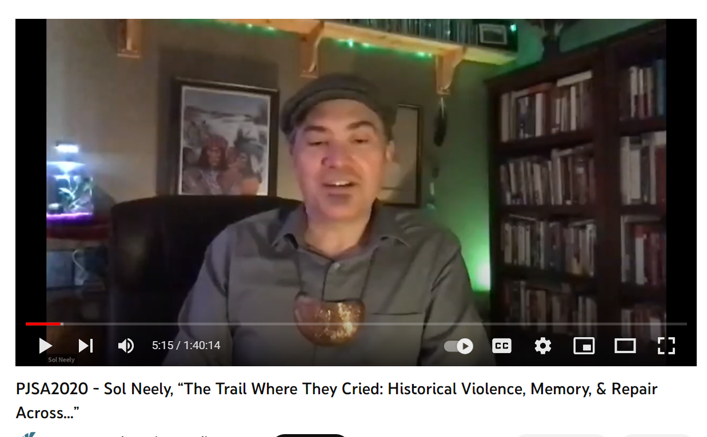
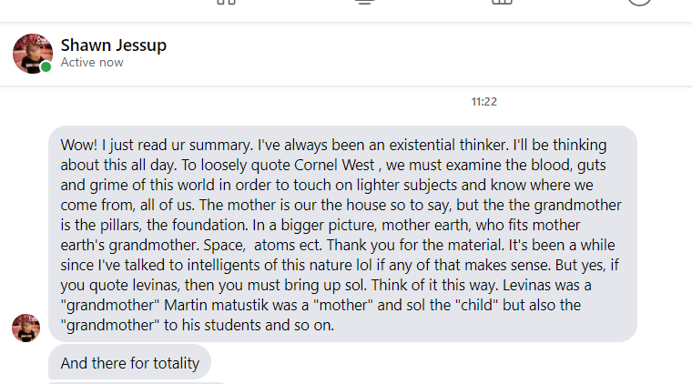

>>Chalagi gadi soli dagudoa  
Sol Neely daguadoa  
ayoneega  gadi  
nagu jigi  
Allensberg Washington  
chineyla asehno  
Alaska  
Tinglit Aani  
chalagi  
de lacagowe   
al de school chalagi   
degladagoowee  
adigay  
coleegayay  
digay  
wolodichnon  

Phenomenal, non?
I don't know what it means. 
I recognize only the names given to relations with others:
* Sol Neely, 
* Alensberg Washington, 
* Alaska,
* Tinglit Aani, ( get this frm sol's paper desciption of this term) what "Tlingit/Inupiaq writer Ishmael Angaluuk Hope calls the "Raven Bioregion" 

The sound of Sol's speech begins with the regard of an other person, the smiling face of his friend  to say "me voici"

We tricksters have to honor each other so I give this talk in honor of Sol Neely 
allomothering, other than mother
in indigenous it's the house
in jewish, the schul, the learning center,
teaching as allomothering

['./']()
LEmon Creek Correctional Facility 

on al lingis: i visited him in baltimore in 2006 while hounding and hitchhiking to the NALS conference at Purdue i love that crazy fool and his pet peacocks  

