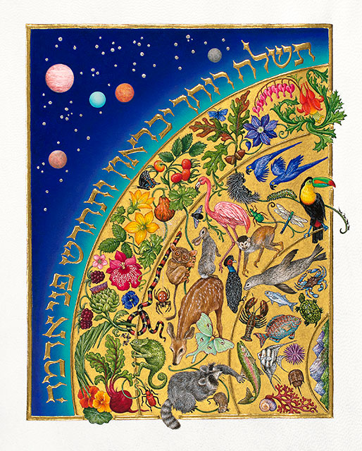
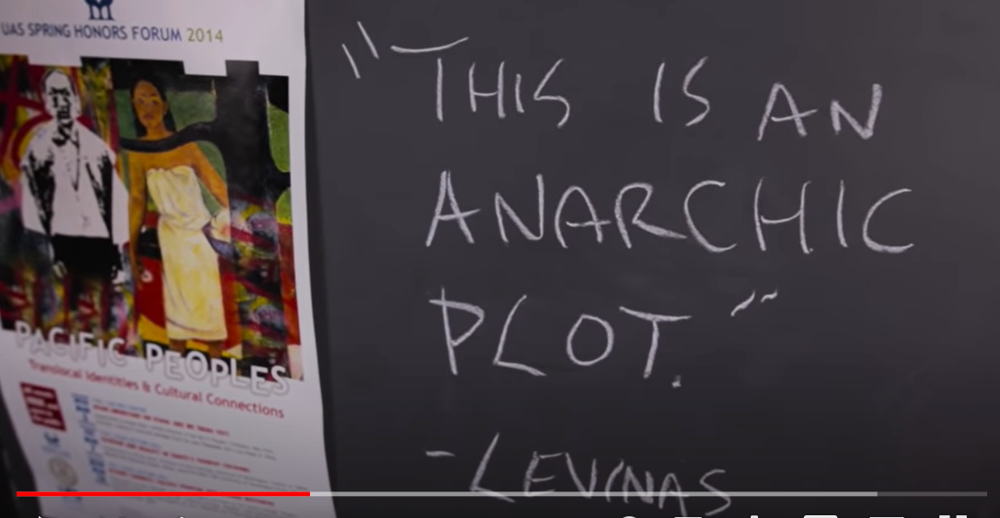

> Chalagi gadi soli dagudoa  
> Sol Neely daguadoa  
> ayoneega  gadi  
> nagu jigi  
> Allensberg Washington  
> chineyla asehno  
> Alaska  
> Tinglit 'Aani  
> chalagi  
> de lacagowe   
> al de school chalagi   
> deladagoowee  
> adigay  
> coleegayay  
> digay  
> woldichonon  

Phenomenal, *non*?  
*I don't know what it means.*
 
I recognize only the names given to relations with others: Sol Neely, Allensberg, Washington, and the concrete locality of Lingít ‘Aaní, Tlingít ancestral land (the word “lingít” means “human”), also called the *Raven Creator Bioregion*, a term coined by the father of Tlingit/Inupiaq writer Ishmael Angaluuk Hope, named for the Raven trickster whose stories narrate the transformations of the land.

From there, Sol journeyed out on what he called an *autoethnography* because he believed it told a story of himself and his origins, yet it was also a *heteroethnography* because the story of Sol himself already incorporates the stories of others --  of his wife Kerry Neely, his daughter Mila Neely, his father George Neely; of generations of Cherokee persons and places of the traumas of the land and of the people; of friends he met on his way; of obstacles to his tortuouus path, his *conatus essendi*.

### The Face of the Earth ( פְּנֵ֣י אֲדָמָֽה) : An Indigenously-Inspired Levinasian Conception of Matrisocial Ecological Becoming

The sound of Sol's speech in the video begins with the smiling face of his friend Wim Laven listening to him, regarding him, awaiting his revelation, his *me voici*.  We still have much to hear in the teaching of Sol Neely.

We tricksters have much to learn from each other.  

In a 2016 paper, our great friend Sol Neely -- whom Eric Garrett describes as a father, a husband, a son, a teacher, an activist, and a great Levinas scholar -- asked us to allow the writings of Emmanuel Levinas to  become inspired by indigenous thought so that we could learn to take ethical responsibility by becoming attuned to "the utterance itself of ancestry and place by which the noise and sounds of nature are at last heard through an inspired eco-phenomenology."  

He learned to become human in Linglit 'Aani where he took responsibility as a professor at University of Alaska Southeast and at The Flying University at The Lemon Creek Correctional Facility, learning from those around him that becoming human entailed becoming responsible in a rich kinship of human and other-than-human relations. 

The question of how we relate to nature and how we will liberate all beings seems especially pertinent right now, both for us right here right now at this conference where we are considering the relationship between humanism and otherness, and for us as humans responsible for abolishing the carceral state and for ending the exploitation and decimation of the natural world.

### Does a snake have a face?

In his paper, Sol explains that several eco-phenomenologists have accused Levinas of setting up human beings at the top of a hierarchy among species.  They base this claim upon an interview with Levinas, in which he is asked, “Does a snake have a face?” And he responds, “I don’t know if a snake has a face. I can’t answer that question.”  Sol responds to the objections of these eco-phenomenologists by explaining that, instead of endorsing domination, Levinas is simply admitting that animals and nature in general experience revelation and inspiration in a different way than we do.  He has no sovereign power to know the interiority of other beings. 

I would add my own notes to this.  

First of all, the uproar over a being *not having a face* indicates a wider misunderstanding of how negativity functions in Levinas’s writing. From the very start of his publications, he explains that negation is essential to otherness. As he states even already in his doctoral thesis, he states "the existence of material things contains in itself a nothingness, à possibility of not-being." (Theory of Intuition in Husserl, p 23) The me who is here now before you is not the same person as the person who was there in the past or the person who will be in the future.  Because beings become within duration, they change, becoming what they are not, transforming from self to other to self and from other to self to other.

Levinas briefly explains this notion of becoming within Totality and Infinity

> A multiplicity of sentients would be the very mode in which a becoming is possible-a becoming in which thought would not simply find again, now in movement, a being subject to a universal law, producing unity. Only in this way does becoming acquire the value of an idea radically opposed to the idea of being, does it designate the resistance to every integration expressed by the image of the river, in which, according to Heraclitus, one does not bathe twice, and according to Cratylus, not even once. A notion of becoming destructive of Parmenidean monism is acquired only through the singularity of sensation. (Totality and Infinity, 59-60)

> Une multiplicité de sentants serait le mode même selon lequel se peut un devenir où la pensée ne retrouverait pas simplement un être en mouvement, se rangeant sous une loi universelle, génératrice d'unité. Le devenir acquiert ainsi seulement la valeur d'une idée radicalement opposée à l'idée de l'être, désigne la résistance à toute intégration que traduit l'image du fleuve, où, d'après Héraclite, on ne se baigne pas deux (Totalite et Infini, 53-54)

Levinas reiterates this critique of Parmenides in Otherwise than Being by explaining that that Plato therefore had to "commit a parricide on his father Parmenides" (AE 213), which refers to the Eleatic Stranger’s discussion of non-being in The Sophist:

> I have a yet a prayer to address to you. Promise not to regard me as a parricide. Because, in self-defense, I must test the philosophy of my father Parmenides, and try to prove by main force, that in a certain sense not-being is, and that being, on the other hand, is not. ( Sophist, 241d)

> Voici encore une prière que j’ai à t’adresser.  C’est de ne pas me prendre pour une espèce de parricide.  Pour nous défendre, il nous faudra soumettre à l’examen la maxime de notre père Parménide, et à toute force établir que le non-être existe à certains égards, et qu’à certains égards aussi l’être n’est pas.

Levinas's explicit usage of the term *parricide* and deliberate repetition with the word *father* indicates that the entire text of Otherwise than Being can be understood as a further exploration of his usage of the metaphor of murder in the section “Time and the Will” to describe the sacrifice of the paternity of the present necessary to father the future of the son. 

> In the being for death of fear I am not faced with nothingness, but faced with what is against me, as though murder, rather than being one of the occasions of dying, were inseparable from the essence of death, as though the approach of death remained one of the modalities of the relation with the Other  (234)

> Dans · l'être pour la mort de la peur, je ne suis pas en face du néant, mais en face de ce qui est contre moi, comme si le meurtre, plutôt que d'être l'une des occasions de mourir, ne se séparait pas de l'essence de la mort, comme si l'approche de la mort de meurait l'une des modalités du rapport avec Autrui. (260)

This proclamation of parricide within the book allows him to instead focus on the theme of maternity and other feminine themes

# Faceless Levinas

But even more troublesome than its misunderstanding of the negative in Levinas, the question betrays a profound misconception of Levinas's term le visage.   
*Does X have a face* is always the wrong question.  It is straightforwardly an ontological question, one of predication, a reifying question, of the Being of Face, of its *quiddity*.  The worship of the Face is idolatry, as we read in the biblical book of Exodus 33:20

> And He said, "You will not be able to see My face, for man shall not see Me and live. (Exodus 33:20)

> L'Eternel dit: Tu ne pourras pas voir ma face, car l'homme ne peut me voir et vivre.

>כוַיֹּ֕אמֶר לֹ֥א תוּכַ֖ל לִרְאֹ֣ת אֶת־פָּנָ֑י כִּ֛י לֹֽא־יִרְאַ֥נִי הָֽאָדָ֖ם וָחָֽי:
>כוַיֹּ֕אמֶר לֹ֥א תוּכַ֖ל לִרְאֹ֣ת אֶת־פָּנָ֑י כִּ֛י לֹֽא־יִרְאַ֥נִי הָֽאָדָ֖ם וָחָֽי:

I challenge Levinas scholars to themselves become iconoclasts, to emulate the patriarch Abraham and to smash the idol of the face and to put an end to its worship.

For Levinas, le visage is not a thing; rather it functions in his work as a metaphor for intentionality.  He expresses this clearly in his doctor d'etat that for Husserl's intentionality 

> … all the forms of our life, affective, practical, and aesthetic, are characterized by a relation to an object. ... Our gaze is directed like a ray from the pure ego to the object correlated to the relevant state of consciousness (thing, state of things, etc. ) and achieves the consciousness of this object which may be very different from case to case.” (Theory of Intuition in Husserl's Phenomenology)

The one who has a visage is one who sees, whose present stance positions the world outside himself vis-à-vis his vision, thereby allowing his masculine, virile subjectivity to consume its externality as his own internal state of consciousness. For Levinas, the *face-to-face* of Levinas is a *man-to-man* faceoff, a reconsideration of, for example, Hegel's discussion of the struggle between self-consciousnesses. (Phenomenology of Spirit 178-188).  

It would wrong to consider this face-to-face relationship between two adult males as the goal of Levinas’s ethical project.  Each section of his text, each moment of his genealogy opens up a new perspective, a different ethical orientation towards the Other, a different hyperbolic Riemann curvature, a different gravitational warping of intersubjective space.  Although the face and the face-to-face are important metaphors in Totality and Infinity, Levinas stops using them in his later work, both to prevent the ontological error of considering the face to be a thing as well as to foreground the ethical depths from which subjectivity is given birth by maternity

### The Face is not the face

Levinas does use the feminine noun *la face* in Totality and Infinity but in a way that is way that has been profoundly betrayed in its English translation.  I visited World traveler, philosopher, translator, and fellow trickster Alphonso Lingis at the Baltimore Travel Plaza with my bestest pal Shorty The Dog -- to he i am for evva true -- in Baltimore in 2007 while hounding and hitchhiking to the NALS conference at Purdue. I love that crazy fool and his pet peacocks but I need to call him out on this error. 

  

Levinas uses the *la face* not to refer to the human visage but rather to the surface or the side of the element, its feminine and material aspect.  Within Totality and Infinity, Levinas explains that the element

> unfolds in its own dimension: depth, which is inconvertible into the breadth and length in which the side of the element extends. To be sure, a thing likewise presents itself by but one unique side; but we can circle round it, and the reverse is equivalent to the obverse; all the points of view are equivalent. The depth of the element prolongs it till it is lost in the earth and in the heavens. “Nothing ends, nothing begins. (p 132)

> Il se déploie dans sa propre dimension la profondeur, inconvertible en largeur et en longueur où s'étend la face de l'élément. La chose, certes, elle non plus, ne s'offre que par une face unique; mais nous pouvons en faire le tour, et l'envers en vaut l'endroit. Tous les points de vue se valent. La profondeur de l'élément le prolonge et le perd dans la terre et dans le ciel « Rien ne finit, rien ne commence.

Lingis explains his regrettable decision to not translate la face as “face”:

> It is in order to reserve the English word ‘face’ to translate ‘visage’ — the countenance of the Other — that we are using the term ‘side’ to translate ‘face’ in this context.

However, for Levinas, *la face* is in many ways the subversion of *le visage*. It exposes raw materiality, the way that the other person’s gravity warps space-time. It extends in the dimension of *depth* rather than the *height* of le visage.  

The ethical *face-to-face* is in actuality both a relationship between *visages* and a relationship between *facades*.  This confrontation can never reveal the interiority of the Other’s exteriority, his position as visage. It only shows the surface of his self-presentation.  

### Elemental Questions 

The question of the element is a fundamental one for Levinas, from the very outset of his antifascist philosophical inquiry. In his 1990 preface to his 1935 article "Reflections on the Philosophy of Hitlerism", Levinas explains:

> The article stems from the conviction that the source of the bloody barbarism of National Socialism  … stems from the essential possibility of elemental Evil into which we can be led by logic and against which Western philosophy had not sufficiently insured itself. (original italics)

While this is most likely a reference to Heidegger's embrace of Heraclitus, his belief that force and conflict are fundamental to the dynamic of becoming, to the flow of change over time has been widely influential: atomism, materialism, Spinoza, Hume, Locke, Hobbes, Hegel, Marx, Nietzsche, Deleuze, Foucault, Bradiotti, deep ecology, ecophenomenology, anarchoprimitivism and many others inherit this basic understanding from Heraclitus. 

He begins the 1935 article:

> The philosophy of Hitler is primordial [primaire]. But the primitive powers that burn within it burst open its wretched phraseology under the pressure of an elementary force. They awaken the secret nostalgia within the German soul. Hitlerism is more than a contagion or a madness; it is an awakening of elementary feelings. 
> But from this point on, this frighteningly dangerous phenomenon becomes philosophically interesting. For these elementary feelings harbor a philosophy. They express a soul’s principal attitude towards the whole of reality and its own destiny. They predetermine or prefigure the meaning of the adventure that the soul will face in the world.

> La philosophie d’Hitler est primaire. Mais les puissances primitives qui s’y consument font éclater la phraséologie misérable sous la poussée d’une force élémentaire. Elles éveillent la nostalgie secrète de l’âme allemande. Plus qu’une contagion ou une folie, l’hitlérisme est un réveil des sentiments élémentaires.
> Mais dès lors, effroyablement dangereux, il devient philosophiquement intéressant. Car les sentiments élémentaires recèlent une philosophie. Ils expriment l’attitude première d’une âme en face de l’ensemble du réel et de sa propre destinée. Ils prédéterminent ou préfigurent le sens de l’aventure que l’âme courra dans le monde.

The elemental takes form as enchainment of the soul to the body:

> Man’s essence no longer lies in freedom, but in a kind of bondage [enchaînement]. To be truly oneself does not mean taking flight once more above contingent events that always remain foreign to the Self’s freedom; on the contrary, it means becoming aware of the ineluctable original chain that is unique to our bodies, and above all accepting this chaining.

> L’essence de l’homme n’est plus dans la liberté, mais dans une espèce d’enchaînement. Etre véritablement soi-même, ce n’est pas reprendre son vol au-dessus des contin­gences, toujours étrangères à la liberté du Moi ; c’est au contraire prendre conscience de l’enchaînement originel inéluctable, unique à notre corps ; c’est surtout accepter cet enchaînement.

These philosophies of elemental force inevitably lead to war and conquest, a world of masters and slaves 

> But force is characterized by another type of propagation. The person who exerts force does not abandon it. Force does not disappear among those who submit to it. It is attached to the personality or society exerting it, enlarging that person or society while subordinating the rest. Here the universal order is not established as a consequence of ideological expansion; it is that very expansion that constitutes the unity of a world of masters and slaves. Nietzsche’s will to power, which modern Germany is rediscovering and glorifying, is not only a new ideal; it is an ideal that simultaneously brings with it its own form of universalization: war and conquest.

> Mais la force est caractérisée par un autre type de propagation. Celui qui l’exerce ne s’en départ pas. La force ne se perd pas parmi ceux qui la subissent. Elle est attachée à la personnalité ou à la société qui l’exerce, elle les élargit en leur subordonnant le reste. Ici l’ordre universel ne s’établit pas comme corollaire d’expansion idéologique — il est cette expansion même qui constitue l’unité d’un monde de maîtres et d’esclaves. La volonté de puissance de Nietzsche que l’Allemagne moderne retrouve et glorifie n’est pas seulement un nouvel idéal, c’est un idéal qui apporte en même temps sa forme propre d’universalisation : la guerre, la conquête.

Levinas's task from the outset of his philosophical project is therefore to conceive the becoming of beings within the flux of time that does not start with the assertion of force and conflict.  That is, Levinas's work is a subversion of not only Heidegger's thinking of Being but moreover as a perversion of Heraclitus's thinking of Becoming, whose dictum  Πάντα ῥεῖ,  everything flows, is further elaborated by his assertion:

> War (polemos) is the master-father (pater) of all beings; and some he has made gods and some men, some slaves and some free  (53)

> La guerre est père de tout, roi de tout, a désigné ceux-ci comme dieux, ceux-là comme hommes, ceux-ci comme esclaves, ceux-là comme libres. (53)

> πόλεμος πάντων μὲν πατήρ ἐστι, πάντων δὲ βασιλεύς, καὶ τοὺς μὲν θεοὺς ἔδειξε τοὺς δὲ ἀνθρώπους, τοὺς μὲν δούλους ἐποίησε τοὺς δὲ ἐλευθέρους. (53)

Levinas opens up Totality and Infinity renouncing the

> obscure fragments of Heraclitus { that } prove that being reveals itself as war to philosophical thought (21)

> obscurs fragments d'Héraclite que l'être se révèle comme guerre, à la pensée philosophique (5)

While this is most likely a reference to Heidegger's writings on Heraclitus, Heraclitus’s belief that force and conflict are fundamental to the dynamic of becoming, to the flow of change over time, has been widely influential, especially on antihumanist thought:  Atomism, materialism, Spinoza, Hume, Locke, Hobbes, Hegel, Marx, Nietzsche, Deleuze, Foucault, Bradiotti, deep ecology, ecophenomenology, anarchoprimitivism and many others inherit this basic understanding from Heraclitus. 

### Continuous Creation 

In order to think otherwise than war and conquest, Levinas conceives of Becoming as continuous creation, as the generation and regeneration of gendered generations.  His conception of continuous creation comes from numerous sources.  He makes clear and distinct references to 
> The discontinuity of Cartesian time, which requires a continuous crea­tion, indicates the very dispersion and plurality of created being (58)

> La discontinuité du temps cartésien demandant une création continuée, enseigne la dispersion même et la pluralité de la créature. (51)

This conception of continuous creation derives not just from Descartes but from Bergson’s interpretation of Descartes: 

> Creation would have appeared not simply as continued, but also as  continuous. The universe, regarded as a whole, would really evolve. The future would no longer be determinable by the present. (Bergson, Creative Evolution, 345)

> La création n’apparaissait plus simplement comme continuée, mais comme continue. L’univers, envisagé dans son ensemble, évoluait véritablement. L’avenir n’était plus déterminable en fonction du présent  (L’evolution creatice, 374)

For Levinas, this indeterminacy which is essential to Bergson’s conception of freedom occurs as the transubstantiation from self into other and from other into self through time.   

More interestingly, the idea of continuous creation is the theme in one of the Jewish morning prayers, a text taken from Psalm 104:30        

> When you send your breath/spirit, they are created, and you renew the face of the earth 

> Tu envoies ton souffle: ils sont créés, Et tu renouvelles la face de la terre.
> תְּשַׁלַּ֣ח ר֖וּֽחֲךָ יִבָּֽרֵא֑וּן וּ֜תְחַדֵּ֗שׁ פְּנֵ֣י אֲדָמָֽה

That is, Jewish liturgy already understands that inspiration and creation come through the face of the earth, PNAY ADAMAH

Levinas seemingly draws from this verse by conceiving creation as a being inspired, breathed-into, birthed through the matrix of maternity into a world of sensible materiality, where it nurses on the element. According to the coming-of-age narrative told through the sections of Totality and Infinity, this newborn grows up, marries a wife, moves into a house, gets a job, grows older, has sex, dies, and is reborn as a new subjectivity.   This transsubstantiation between self and other through time, an idea of continuous creation, of the regeneration of gendered generations, a birthing into the material and temporal responsibilties of maternal birthing and being-born. 

> The-one-for-another has the form of sensibility or  vulnerability, pure passivity or susceptibility, passive to the point of becoming an inspiration, that is, alterity in the same, the trope of the body animated by the soul, psyche in the form of a hand that gives even the bread taken from its own mouth. Here the psyche is the maternal body. (67)

> l’un pour l’autre en guise de sensibilité, ou de vulnérabilité; passivité ou susceptibilité pure, passive au point de se faire inspiration, c’est-à-dire précisément altérité-dans-le-même, trope du corps animé par l’âme, psychisme sous les espèces d’une main qui donne jusqu’au pain arraché à sa bouche. Psychisme comme un corps maternel. (109)

### The Flying University: Allomothering as Prison Maieutics

In her book *Maternal Thinking*, Sarah Ruddick defines the maternal standpoint not as an instinctive disposition or a specifically gendered role but rather as a set of practices that preserves the life of the child, nourishes their growth, and prepares them for acceptance in the wider society.  The anthropologist Sarah Hrdy adds an additional dimension to this idea of maternal practice by explaining that  the evolutionary success of childrearing does not rest on the mother alone but rather on the community of caretakers around her, allomothers, persons other than the mother who are willing and capable of performing the tasks of childcare, and who will return the child intact to the mother once they are done with it.    Anthropologists have found that the person who has proven to be most reliable in performing this allomothering role is the grandmother who dedicates herself to keeping both the mother and the grandchild healthy and well-fell.

According to Sol's students at the Flying University, Sol could be understood as a maternal figure. Sol turned the Lemon Creek Correctional Facility into a *schul*, teaching them, enacting the practice of *maieutics*, acting as a midwife to aid in the birthing of their philosophical understanding.  His student Shawn Jessup explains 

LEmon Creek Correctional Facility 

> The mother is our the house so to say, but the grandmother is the pillars, the foundation. In a bigger picture, mother earth, who fits mother earth's grandmother.  ... But yes, if you quote levinas, then you must bring up sol. Think of it this way. Levinas was a *grandmother* Martin matustik was a *mother* and sol the *child* but also the *grandmother* to his students and so on.

 Another student, who was not an inmate himself but who grew up with an imprisoned father, remarked that his father told him that his best days in prison were 

> the days that people would come in and play Monopoly or checkers or have a book club or teach a class or have a religious service or those types of events because in those moments he encountered strangers but those strangers would look him in the face and those strangers would look him and they would meet his gaze and he said it made him feel human and so what I thought Sol was offering me was the opportunity to go and maybe try to make  some other people feel human that could use that in their lives

# Singing in the earth with an indigenously-inspired Levinas

Most if not all Native American cultures recognize the Earth as Mother, as the source of all the gifts that nourishes, nurses, and sustains and all life.   Furthermore, most if not all Native American societies are matrilineal and centered around a “long house” or similar matrisocial communal space.  According to Barbara Alice Mann, the Iroquois explicitly recognized this creative and sustaining role of Mother Earth and of women within society:

> The supply of food and gift items was in the hands of the Gantowisas (women elders), which meant that they had explicit responsibility for rendering and maintaining the Iroquoian gift economy. This was a clear expression of the resonance between the gift giving Earth and gift giving women: just as the mound beds were regarded as the breasts of Mother Earth, the corn her milk, so the gifting of the Gantowisas was compared with breast-feeding. Gift giving was considered a motherly action from which all people drew their lives.

The Ashinaabe biologist Robin Wall Kimmerer explains that most if not all Native cultures understand that all of creation, even things which seem to be non-living, are considered animate, inspired by spirit.  She explains this “grammar of animacy”:

> A bay is a noun only if water is dead. When bay is a noun, it is defined by humans, trapped between its shores and contained by the word. But the verb wiikwegamaa— to be a bay— releases the water from bondage and lets it live. .... So it is that in Potawatomi and most other indigenous languages, we use the same words to address the living world as we use for our family. Because they are our family. To whom does our language extend the grammar of animacy? Naturally, plants and animals are animate, but as I learn, I am discovering that the Potawatomi understanding of what it means to be animate diverges from the list of attributes of living beings we all learned in Biology 101. In Potawatomi 101, rocks are animate, as are mountains and water and fire and places. Beings that are imbued with spirit, our sacred medicines, our songs, drums, and even stories, are all animate. The list of the inanimate seems to be smaller, filled with objects that are made by people. Of an inanimate being, like a table, we say, “What is it?” And we answer Dopwen yewe. Table it is. But of apple, we must say, “Who is that being?” And reply Mshimin yawe. Apple that being is. Yawe— the animate to be. I am, you are, s/ he is. To speak of those possessed with life and spirit we must say yawe. 

In his lectures, Sol often liked to tell a Cherokee story that expresses their recognition of humanity’s deep connection with the Earth and our responsibility to nurture and protect it.  It tells of a Cherokee spirit who manifested in the council-house to foretell of their oncoming slaughter by white settler-colonialists.  Half of the people at the meeting followed him, where they found safety by hiding inside the sacred mountain of the Cherokee, now known as Clingman’s Dome.  It was so beautiful inside that he decided to go back to fetch his family and bring them back.  But when he came back, the mountain was closed so he sat there for seven days

> The seventh day he began to hear the singing deep within the earth and so he went back to the village and from that day forward he told the people in the village that if you're quiet enough long enough and if you sit and listen to the streams and really are aware and very quiet and still that you too can hear the people singing within the earth those happy ones that went on before.  And sure enough the settlers came and they began to burn the villages and take away the land and the Cherokee people have been searching for that happiness they had long long ago and i think the teaching of this story not only was the fact there was a revelation of what was about to happen people losing their homeland on the trail of tears and so on but also to teach us that we should    never let the child disappear from us you remember when you were a child when you would take off your shoes and prawn through the mud puddles and laugh and sing remember when you were a child that not a butterfly passed that you didn't see it and chase it and not an animal or an insect were overlooked and that you were so close to nature and so close to mother earth that those were the things that were important to you we should remain like children and sometimes take our shoes off and plod through the mud puddles and sit by the streams and listen to the talking of the streams and the whispers of the wind. We must preserve the earth and we must value the lives of our elders in the lives of our children and save them a place to live if we don't then there will be a revelation for the people of today as well as for all of the Cherokee

